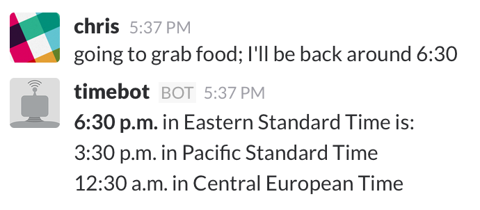

# timebot

*Talk seamlessly across timezones in Slack.*

Slack knows your timezone, and those of your coworkers, since you’ve all set it in your Slack profiles.

Once you’ve added **timebot** to a channel, it listens for mentions of times in that channel, and automagically translates times into the correct timezone for everyone else in the channel:

## Installation

1. Clone the repo and run `npm install`
2. [Create a bot token](https://get.slack.help/hc/en-us/articles/215770388-Create-and-regenerate-API-tokens) in Slack. Put it in `token.txt`. (“Seamlessly translates times for everyone in the channel.” is a nice thing to put in the “What this bot does” field.)
3. Run `npm start`
4. Invite timebot to one or more channels

See also [the FAQ](docs/faq.md).

## FAQ

See: [the FAQ](docs/faq.md).

## License

MPL-2.0. See [`LICENSE`](LICENSE).

## Author

Chris Dzombak, [dzombak.com](https://dzombak.com)
