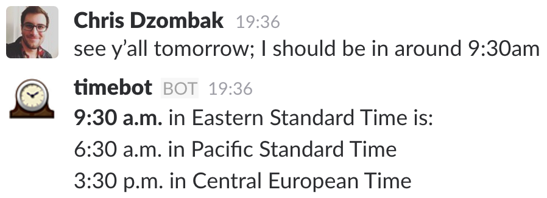

# timebot

*Talk seamlessly across timezones in Slack.*

Slack knows your timezone, and those of your coworkers, since you’ve all set it in your Slack profile.

Once you’ve added **timebot** to a channel, it listens for mentions of times in that channel, and automagically translates it into the correct timezone for everyone else in the channel:

